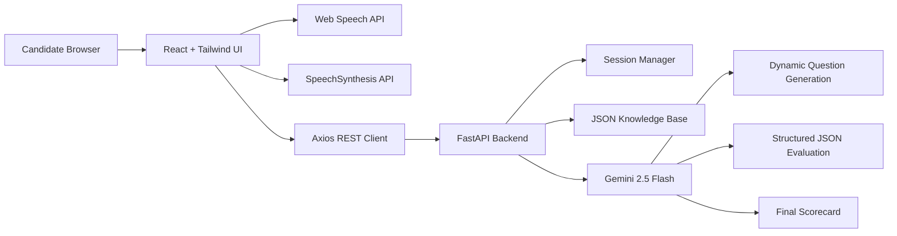

# AI Voice Interview Coach

Production-ready hackathon project for adaptive voice-based HR and SDE mock interviews.

## System Architecture



## Database Design

The project uses `dataset/interview_knowledge_base.json` as a lightweight JSON database.

```json
{
  "interview_types": {
    "technical_sde": {
      "label": "Technical Interview (SDE)",
      "opening": "Greeting text",
      "topics": [
        {
          "id": "oop",
          "name": "Object-Oriented Programming",
          "competencies": ["encapsulation", "abstraction"],
          "seed_question_intents": ["Ask about design principles."],
          "evaluation_rubric": "How strong answers should be judged."
        }
      ]
    }
  }
}
```

Runtime session state is in memory and tracks session id, interview type, shuffled topic order, current question, already asked questions, follow-up attempts, answer transcripts, evaluations, coaching hints, and aggregate scores. For persistence, replace the in-memory dictionary in `backend/app/services/session_manager.py` with SQLite using the same session model.

## API Design

- `GET /api/health` - service health check
- `GET /api/interview-types` - list HR and Technical SDE interview options
- `POST /api/sessions` - create a new adaptive interview session
- `GET /api/sessions/{session_id}` - fetch current session state
- `POST /api/sessions/{session_id}/answers` - submit transcript, evaluate, and receive follow-up/coaching/next question
- `POST /api/sessions/{session_id}/complete` - generate final performance report

## Folder Structure

```text
voice-interview-agent/
  backend/
    app/
      config.py
      knowledge_base.py
      schemas.py
      services/
        gemini_service.py
        session_manager.py
    main.py
    requirements.txt
  dataset/
    interview_knowledge_base.json
  frontend/
    src/
      components/
      hooks/
      services/
      styles/
      App.jsx
      main.jsx
    package.json
    vite.config.js
  render.yaml
  vercel.json
```

## Local Development

Backend:

```bash
pip install -r backend/requirements.txt
uvicorn backend.main:app --reload --host 127.0.0.1 --port 8000
```

Frontend:

```bash
cd frontend
npm install
npm run dev
```

Set `GEMINI_API_KEY` in `.env`. The frontend uses browser-native speech recognition and text-to-speech, so Chrome or Edge is recommended.
